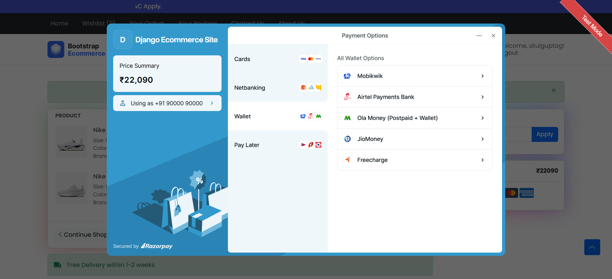
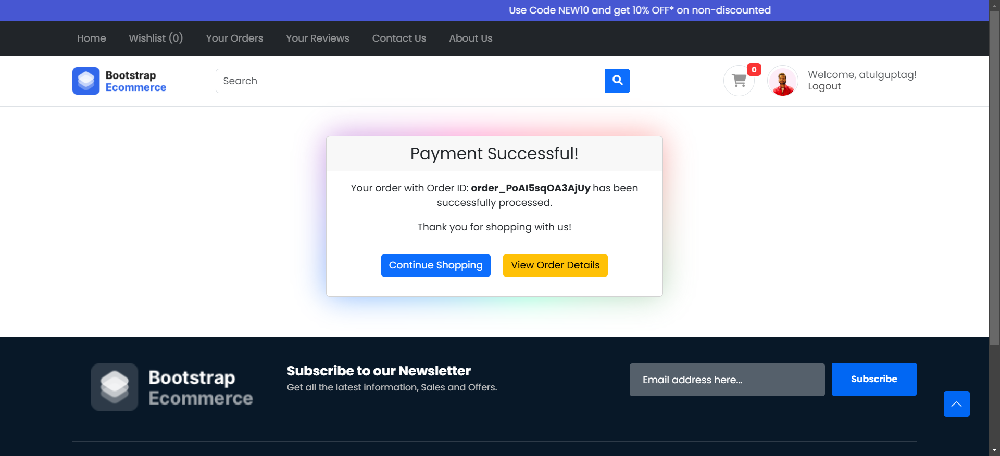
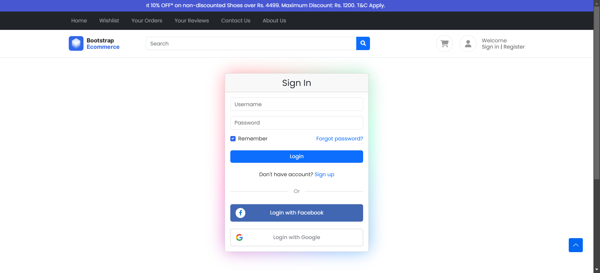
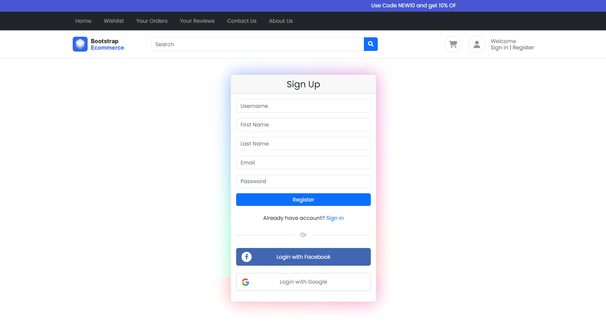
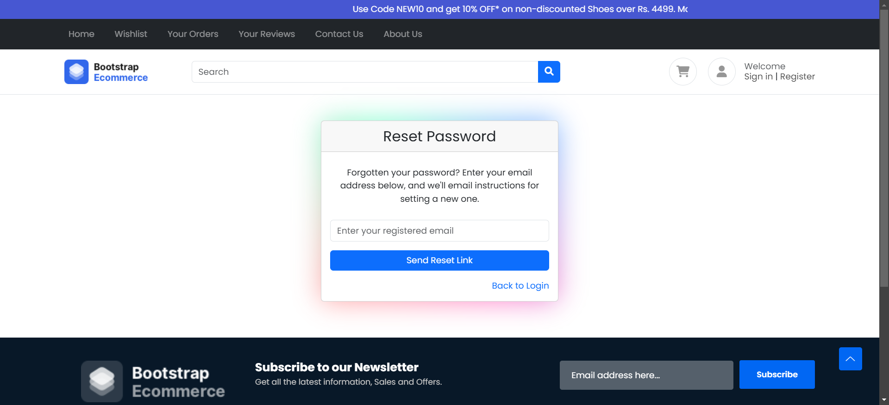

# Django eCommerce Website

<div align="center">

[](https://github.com/zephy0808/django-ecommerce-website/issues)


[](https://github.com/zephy0808/django-ecommerce-website/contributors)
[](https://djangoecommercewebsite.pythonanywhere.com/)


</div>

This project is a full-fledged eCommerce website built using Django, a high-level Python web framework. It includes essential features such as user authentication, product browsing, cart management, checkout process, payment integration, and more. The website is designed to be robust, scalable, and user-friendly, providing a seamless shopping experience for customers.

## Table of Contents

- [Features](#features)
- [Screenshots](#screenshots)
- [Technologies Used](#technologies-used)
- [Setup Instructions](#setup-instructions)
- [Usage](#usage)
- [Contributing](#contributing)
- [License](#license)

## Features

- **User Authentication:** Secure user registration, login, reset password, and profile management.
- **Product Catalog:** Browse and search products with detailed descriptions and images.
- **Shopping Cart:** Add, update, and remove items from the cart seamlessly.
- **Checkout Process:** Smooth checkout flow with order summary and address management.
- **Payment Integration:** Integrated with Razorpay for secure online payments.
- **Order Management:** View order history and status updates.
- **Social Authentication:** Login with Google and Facebook accounts.
- **Responsive Design:** Mobile-friendly UI ensuring a consistent experience across devices.
- **Admin Panel:** Manage products, orders, and users efficiently through Django's admin interface.

## Screenshots

### Home Page


### Wishlist Page


### Order History Page


### Order Details Page


### Contact-Us Page


### About-Us Page


### Product Page


### Shopping Cart Page


### Payment Testing View Page



### Payment Success Page



### Login Page



### Register Page



### Reset Password Page



### Profile Page


### Shipping Address Page


### Change Password View


## Technologies Used

- **Django:** Python-based web framework for backend development.
- **HTML/CSS/JavaScript:** Frontend development for a responsive and interactive UI.
- **Razorpay API:** Payment gateway integration for secure transactions.
- **Bootstrap:** Frontend framework for responsive design and UI components.
- **Django Allauth:** Social authentication integration for Google and Facebook.
- **Django Countries:** Country field for forms and models.
- **Crispy Forms:** Enhanced form rendering with Bootstrap styling.

## Setup Instructions

To run this project locally, follow these steps:

1. **Clone the repository:**

   ```bash
   git clone https://github.com/zephy0808/django-ecommerce-website.git
   cd django-ecommerce-website
   ```

2. **Create a virtual environment:**
   ```bash
   python -m venv venv
   ```

3. **Activate the virtual environment:**

   - On Windows:
     ```bash
     .\venv\Scripts\activate
     ```
   - On macOS/Linux:
     ```bash
     source venv/bin/activate
     ```

4. **Install dependencies:**
   ```bash
   pip install -r requirements.txt
   ```

### Environment Configuration

Before running `python manage.py migrate`, create a `.env` file in your project root directory and configure it with the following variables:

```env
SECRET_KEY=your_secret_key_here
DEBUG=True
SOCIAL_AUTH_FACEBOOK_KEY=your_facebook_app_key
SOCIAL_AUTH_FACEBOOK_SECRET=your_facebook_app_secret
```

**How to generate the SECRET_KEY:**

1. Open your terminal (ensure your virtual environment is activated)
2. Run the Django shell:
   ```bash
   python manage.py shell
   ```
3. Generate a secret key:
   ```python
   from django.core.management.utils import get_random_secret_key
   print(get_random_secret_key())
   ```
4. Copy the generated key and add it to your `.env` file

5. **Apply database migrations:**

   ```bash
   python manage.py migrate
   ```

6. **Create a superuser (admin):**

   ```bash
   python manage.py createsuperuser
   ```

7. **Start the development server:**

   ```bash
   python manage.py runserver
   ```

8. **Open your web browser and navigate to:**
   ```
   http://127.0.0.1:8000/
   ```

### Social Authentication Setup

After navigating to the application, if you encounter errors related to social authentication:

1. Navigate to the admin panel: `http://127.0.0.1:8000/admin/`
2. Login with your superuser credentials
3. Go to **Sites** → **Social Applications**
4. Add your Google and Facebook app credentials:
   - **Google:** Add your Google Client ID and Secret
   - **Facebook:** Add your Facebook App ID and Secret


## Usage

- **Admin Panel:** Access the admin panel at `http://127.0.0.1:8000/admin/` to manage products, orders, and users.
- **Shopping:** Browse products, add items to the cart, proceed to checkout, and make payments using Razorpay.
- **Profile Management:** Users can register, login, reset passwords, view order history, and update their profiles.
- **Social Login:** Users can authenticate using their Google or Facebook accounts.

## Project Structure

```
django-ecommerce-website/
├── ecomm/                 # Main project directory
│   ├── settings.py        # Django settings
│   ├── urls.py           # URL configuration
│   ├── wsgi.py           # WSGI configuration
│   └── asgi.py           # ASGI configuration
├── accounts/             # User authentication and profile management
├── products/             # Product catalog and management
├── home/                 # Home page and general views
├── templates/            # HTML templates
├── static/              # Static files (CSS, JS, images)
├── Screenshots/         # Application screenshots
├── requirements.txt     # Python dependencies
├── manage.py           # Django management script
└── README.md           # Project documentation
```

## Contributing

Contributions are welcome! Please follow these steps:

1. Fork the repository
2. Create a feature branch (`git checkout -b feature/amazing-feature`)
3. Commit your changes (`git commit -m 'Add some amazing feature'`)
4. Push to the branch (`git push origin feature/amazing-feature`)
5. Open a Pull Request

## License

This project is licensed under the [MIT License](LICENSE).

## Support

If you find this project helpful, consider giving it a ⭐ on GitHub!

## 💰 Support the Developer

You can help support the development of more projects like this:

[](https://paypal.me/zephy0808)
